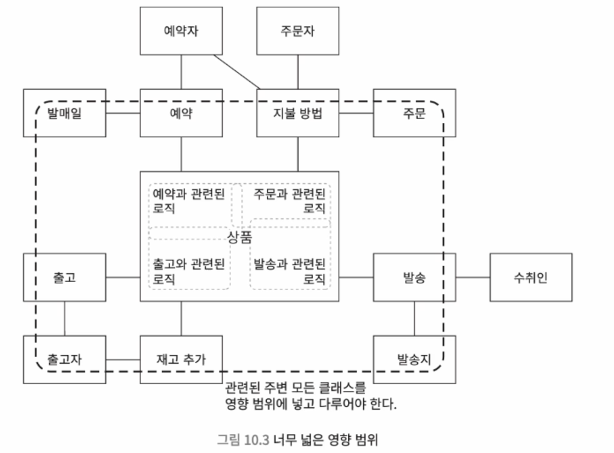
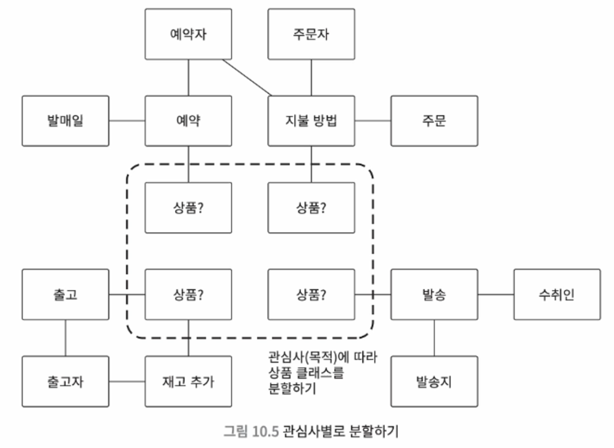
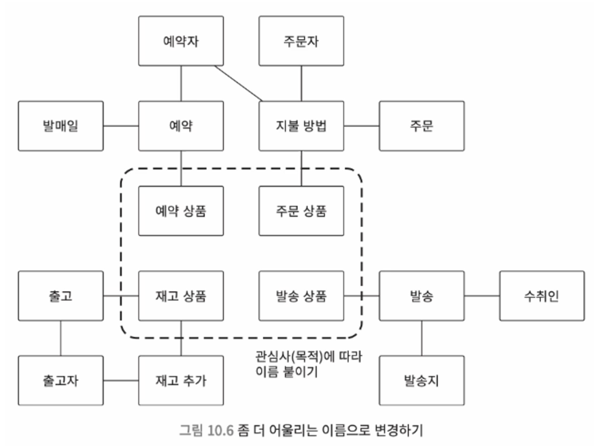

# 10. 이름 설계 : 구조를 파악할 수 있는 이름

> ❄️ 기본적으로 목적 중심 이름 설계를 사용한다. <br>
> 이는 이름에서 목적과 의도를 이해할 수 있게 설계하는 것이 목적으로, 소프트웨어가 달성해야 하는 목적을 기반으로 이름을 설계하는 방법이다.

## 10.1 악마를 불러들이는 이름

- 상품을 그대로 ‘상품 클래스’라고 이름 짓는다면?
    - 상품과 여러 클래스가 관련을 가지면서 점점 강결합 구조가 된다.
    - 이 때, 상품 클래스에 사양 변경이 생기면 영향 범위가 너무 넓어진다.

### 관심사 분리


- 상품이 예약, 주문, 발성 등 다양한 관심사와 결합되어 온갖 로직을 품은 강결합 구조가 되었다.
- 또한 너무 이름이 포괄적이어서 목적이 불분명한 목적 불명 객체가 되었다.
- **강결합을 해소하고 결합이 느슨한 응집도가 높은 구조를 만들기 위해, 관심사 분리가 필요**하다.
    - 각 관심사 (유스케이스, 목적, 역할)에 따라서 클래스를 분리하는게 중요!
  



<br>

---

## 10.2 이름 설계하기 - 목적 중심 이름 설계

> ❄️ 이름 설계 : 클래스와 메서드에 이름을 붙이는 것. <br>
> (설계 : 어떤 문제를 해결하기 위한 구조를 생각하거나 만드는 것)

- 프로그래밍에서 이름은 **단순 가독성만 높이는 것이 아니라, 결합이 느슨하고 응집도가 높은 구조를 만드는데 기여**한다.
  - 관심사 분리를 생각하고, 비즈니스 목적에 맞게 이름을 붙이는 과정이 굉장히 중요!

### 목적 중심 이름 설계의 중요한 포인트
  - 최대한 구체적이고, 의미 범위가 좁고, 특화된 이름 선택하기
    - 이름과 관계 없는 로직을 배제하기 쉽다
    - 클래스가 작아지고, 관계된 클래스 수도 적어진다.
    - 따라서 결합도가 낮아지고, 사양 변경시 영향이 줄어든다.
    - 목적 특화된 이름이라 어떤 부분을 변경해야 할 때 쉽게 찾을 수 있고 개발 생산성이 향상된다.
  - 존재가 아니라 목적을 기반으로 하는 이름 생각하기
    - 단순히 존재를 나타내는 이름 : 의미가 여러 곳에서 사용되기 쉽고 목적이 불분명해짐
    - 구체적인 목적을 알 수 있는 이름을 짓는게 중요하다.
    - ex. ‘주소’ 대신, ‘발송지’, ‘배송지’ 같은 특화된 이름
    - ex. ‘금액’ 대신, ‘청구 금액’, ‘소비세액’, ‘연체 보증료’, ‘캠페인 할인 금액’
  - 어떤 관심사가 있는지 분석하기
    - 어떤 비즈니스를 하는지 파악하기 위해, 소프트웨어가 추구하는 목적과 내용을 분석한다.
  - 소리 내어 이야기해 보기
    - 비즈니스 측면을 잘 이해하고 있는 사람과 이야기해보자. 목적과 의도를 잘못 인식하고 잇는 부분이 있다면 바로 피드백을 받을 수 있다.
    > 고무 오리 디버깅 : 프로그래밍에서 어떤 문제가 발생했을 때, 그걸 누군가에게 설명하다 보면 스스로 원인을 깨닫고 해결할 수 있다는 방법 <br>
  
    > 유비쿼터스 언어 : 팀 전체에서 의도를 공유하기 위한 언어
  - 이용 약관 읽어 보기
    - 이용 약관에는 서비스와 관련된 규칙이 굉장히 엄격하게 작성되어 있다.
    - 이런 비즈니스 규칙과 클래스를 일치하게 만들면, 정확하고 빠르게 변경할 수 있다
  - 다른 이름으로 대체할 수 없는지 검토하기
    - ex. ‘고객’ vs ‘숙박하는 사람’ or ‘결제하는 사람’
    - 이 경우, ‘숙박하는 고객’ = ‘투숙객’, ‘결제하는 고객’ = ‘결제자’
    - 사전에서 유의어를 찾아보는 것도 좋다!
  - 결합이 느슨하고 응집도가 높은 구조인지 검토하기
    - 목적 외의 로직이 섞이면 이름을 잘못 붙인게 아닌지 검토해보자
    - 다른 클래스 몇 개와 관련되어 있는지 개수를 확인하면 결합도를 확인하는데 도움이 된다

---
## 10.3 이름 설계 시 주의 사항

### 이름에 관심 갖기

- 목적 중심 이름 설계는 **‘이름에 주의를 기울이고, 이름과 로직을 대응시킨다’**를 전제로 한다.
- 팀 개발에선 이름이 중요하다.
  - 이름과 로직이 대응된다는 전제, 이름이 프로그램 구조를 크게 좌우한다는 사실을 팀원들과 이야기 하자.

### 사양 변경 시 ‘의미 범위 변경’ 경계하기

- 개발 중 사양 변경으로 인해 맥락에서 언어가 의미하는 바가 점점 바뀌는 경우가 있다.
  - 따라서 **이름 설계는 중간중간 다시 검토**해 봐야 한다!
- 여러 의미가 섞이면 의미를 다시 검토하고, 이름을 변경하거나 클래스를 나누어야 한다.

### 대화에는 등장하지만 코드에는 등장하지 않는 이름 주의하기

- 대화에 자주 등장하는 중요한 개념이 소스 코드에선 이름도 없거나, 로직에 묻혀 있는 경우가 있다.
  - 이런 코드는 직접 구현한 사람 아니면 알기도 어렵고, 존재를 파악하는 것 조차 힘들다.
  - 또한 소스 코드 이곳 저곳에 무분별하게 작성되는 경향이 있다.
- **대화에서 등장하는 이름을 신경쓰고, 이를 기반으로 메서드와 클래스를 설계**하자.

### 수식어를 붙여서 구별해야 하는 경우는 클래스로 만들어 보기

- ex. member.maxHitPoint는 ‘캐릭터의 원래 최대 히트포인트’일까, ‘장비 착용으로 높아진 최대 히트포인트’ 일까?
- 의미가 다르거나 조건에 따라 달라지는 대상을 같은 이름으로 표현하면 차이를 구별하기 어렵다.
- 따라서 **의미 차이를 확실하게 알 수 있는 이름을 붙이고**, 만약 **수식어를 붙여서 차이가 나타난다면, 각각을 클래스로 설계할 수 없는지를 검토**하자.

---

## 10.4 의미를 알 수 없는 이름

```java
int tmp3 = tmp1 - tmp2;
if (tmp3 < tmp4) {
	tmp3 = tmp4;
}
int tmp5 = tmp3 * tmp6;
return tmp5;
```

- tmp의 의미는 뭔지, 이 전체 코드는 무슨 목적으로 작성되었는지 알 수 없다.
  - 목적 중심 이름 설계의 관점에서 봤을 때, 관심사 분리도 안되었고, 책무도 알 수 없고, 강결합 구조다.
- 인간의 주의력에는 한계가 있어, 항상 사양과 로직을 정확하게 해석할 수 없다. 의미가 불분명하다면 이는 더욱 심화된다. 다음은 의미가 불분명한 이름이 되기 쉬운 경우들이다.

### 기술 중심 명명

- 기술을 기반으로 이름 짓는 방법
  - ex. memory, cache, thread, register, function, method 등..
- 이들은 소프트웨어 구현 방법일 뿐, 비즈니스 목적을 나타내는 데에는 적합하지 않다는 것을 주의하자.

### 로직 구조를 나타내는 이름

- ex. 게임에서 멤버가 마법을 사용할 수 있는 상태인지 판정하는 로직
  - 히트 포인트가 0보다 큰가?
  - 행동 가능한 상태인가?
  - 매직 포인트가 남아 있는가?
- 위 세 조건을 만족할 때, true를 리턴하는 메서드의 이름을 `isMemberHpMoreThanZeroAndIsMemberCanActAndIsMemberMpMoreThanMagicCostMp`로 짓는다면?
  - 어차피 메서드 이름을 봐도 무엇을 의도하는지 알기 힘들다.
- 로직 구조를 그대로 녹이는게 아니라, **의도와 목적을 이해하기 쉽게 이름 짓는 것이 중요**하다.
  - canEnchant

### 놀람 최소화 원칙

- 사용자가 예상하지 못한 놀라움을 최소화하도록 설계해야 한다는 접근 방법

```java
int count = order.itemCount(); // 주문 상품 수를 리턴하는 것처럼 보인다

class Order {

	// 실제로는 주문 상품 수 리턴 뿐 아니라, 기프트 포인트도 추가하고 있다.
	int itemCount() {
		int count = items.count();
		if (10 <= count) giftPoint = giftPoint.add(new GiftPoint(100));
		return count;
	}

}
```

- 위와 같은 코드라면 itemCount를 사용하는 사람은 예기치 못한 결과를 야기하기 쉽다.

```java
int count = order.itemCount();

class Order {

	int itemCount() {);
		return items.count;
	}

	boolean shouldAddGiftPoint() {
		return 10 <= itemCount();
	}

	void tryAddGiftPoint() {
		if (shouldAddGiftPoint()) giftPoint = giftPoint.add(new GiftPoint(100)
	}

}
```

- 따라서 **로직과 의도가 일치하게 놀람 최소화 원칙을 신경써서 설계**하자.

---
## 10.5 구조에 악영향을 미치는 이름

### 데이터 클래스처럼 보이는 이름

- `~Info`, `~Data`와 같은 이름의 클래스는 ‘데이터만 갖는 클래스니, 로직을 구현하면 안된다’ 는 이미지를 심어주기 좋다. 동시에 응집도가 낮은 구조가 되기 쉬워진다.
- 따라서 **~Info, ~Data와 같은 데이터만 갖는다는 인상을 주는 이름은 피하자**.

> ❄️ 단, CQRS 아키텍처 패턴에서 사용하는 데이터 전송 용도로 사용되는 디자인 패턴 DTO는 예외다. <br>
> DTO는 말 그대로 **데이터를 담고, 출력하는 쪽에 전송하기만 하는 클래스로, 값 변경이 필요 없다**. <br>
> 따라서 참조 용도로만 사용되어야 하므로, 값을 변경하는 용도로 쓰면 오히려 응집도가 낮아진다. <br>
> 데이터 클래스를 절대 쓰지 말라가 아니라, 의도를 이해하고 상황에 맞게 사용하라는 것!


### 클래스를 거대하게 만드는 이름

- Manager와 같이 특정 개념과 관련된 모든 데이터를 전부 처리하는 클래스를 만들면, 클래스가 너무 커진다.
  - 사양이 변경되었을 때 어디를 수정해야 할지도 모르겠고, 전혀 관련 없는 곳에 변경 영향이 미치고..
- 이 경우 너무 많은 책무를 떠안아 단일 책임 원칙을 위반하게 된다.
- **책무가 다른 로직은 다른 클래스로 정의하고, SRP를 지키자.**

### 상황에 따라 의미가 달라질 수 있는 이름

- 용어는 상황에 따라 의미가 달라진다.
  - ex. Account
    - 금융 업계 : 계좌
    - 컴퓨터 보안 : 로그인 보안
  - ex. 자동차
    - 배송 컨텍스트 : 자동차가 화물로 배송되는 컨텍스트 - 발송지, 배송지, 배송 경로..
    - 판매 컨텍스트 : 자동차가 딜러에 의해 판매되는 컨텍스트 - 판매 가격, 판매 옵션..
- **컨텍스트의 차이를 고려하여 클래스를 설계하는게 중요**하다.
  - 만약 컨텍스트가 다르다면, 분리하고 서로 다른 패키지로 선언하여 느슨한 결합으로 설계하자.

### 일련번호 명명

- 클래스와 메서드의 이름에 번호를 붙여 만드는 것
- 이름을 수정하려고 하면, 번호를 관리하는 쪽에서 반대할 수 있고, 따라서 수정하는 것이 힘들다.
  - 목적과 의도를 알기도 어렵고, 구조를 개선하기도 힘든 방법!

---

## 10.6 이름을 봤을 때, 위치가 부자연스러운 클래스

### 동사+목적어 형태의 메서드 이름 주의하기

- ex. Enemy 클래스의
  - escape()
  - consumeMagicPoint()
  - addItemToParty()
- 관심사 측면에서 봤을 때, addItemToParty()는 주인공의 소지품을 다루기에 적의 관심사와 전혀 관계 없다.
  - 서둘러서 구현해야 할 때, 기존 클래스만 가지고 어떻게든 끝내려고 하다 이렇게 되기 쉽다.
- 관심사가 다른 메서드는 ‘동사 + 목적어’ 형태가 되는 경향이 있다.
- 클래스를 잘 설계하려는 습관을 들이고, 메서드 이름과 관련된 규율을 만들자.

### 가능하면 메서드의 이름은 동사 하나로 구성되게 하기

- 관심사가 다른 메서드가 섞이지 못하게 막기 위해, 메서드 이름이 동사 하나로 구성되게 설계하면 좋다.
- ‘동사 + 목적어’ 형태의 메서드

  **→ ‘목적어’의 개념을 나타내는 클래스를 따로 만들기.**

  **→ 이 클래스에 ‘동사’ 형태의 메서드 추가하기**

- ex. ‘PartyItems’ 클래스 만들고, 내부에 ‘add’ 메서드 만들기

### 부적절한 위치에 있는 boolean 메서드

- boolean 자료형을 리턴하는 판정 메서드도, 주의하지 않으면 관련 없는 클래스에 구현되기 쉽다.
- **‘클래스 is 상태’ 문장으로 바꾸었을 때 위화감이 없다면 올바른 곳에 위치한 것이다.**
  - ex. Common 클래스의 isMemberInConfusion()

    → Common is member in confusion (X)
    → Member is in confusion (O)

    따라서 이 경우, Member 클래스의 isInConfusion()으로 수정한다.


---

## 10.7 이름 축약

### 의도를 알 수 없는 축약

```java
int trFee = brFee + LRF * dod; // 렌탈 요금 총액을 계산하는 로직
```

- 주석과 문서가 없다면, 이게 무슨 계산식인지 직접 유추해야 해서 가독성이 떨어진다.

### 기본적으로 이름 축약하지 말기

- 요즘은 이름이 길어도, 어차피 IDE에서 자동 완성 기능을 제공해준다!
- 좀 귀찮아도 이름 줄이지 말고 모두 쓰는게 가독성을 높이고, 유지보수하는데 도움이 된다.
  - 하지만 만약, 축약한 이름이 통용된다면 괜찮다. ex. SNS, VIP 등

### 이름을 축약할 수 있는 경우

- 이름을 축약했을 때, 의미가 사라지지는 않는지, 추가적인 다른 문제가 발생하지는 않는지를 꼭 확인해보자.