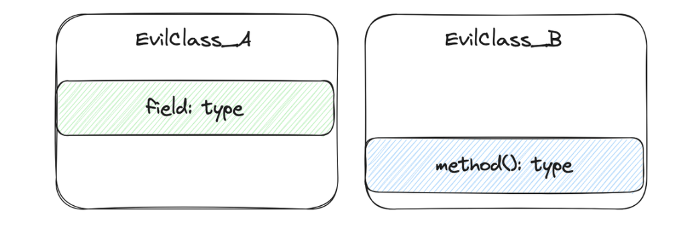
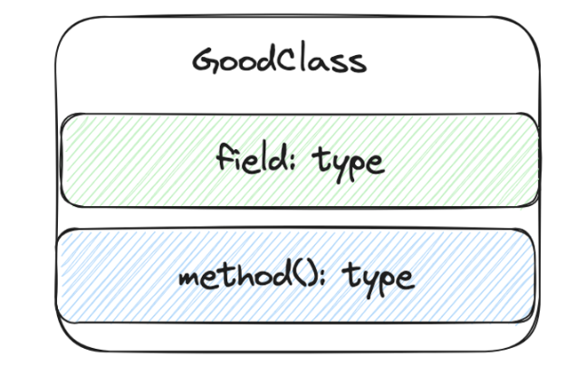

# 3. 클래스 설계 : 모든 것과 연결되는 설계 기반

> 
> 💡 **클래스 기반 클래스 설계** : 데이터와 그 데이터를 조작하는 논리를 클래스 단위로 묶어 정의하는 방법
> 

## 3.1 클래스 단위로 잘 동작하도록 설계하기

> 💡 **클래스 단위로 잘 동작하다** <br>
> : 클래스 하나로도 잘 동작할 수 있어야 한다. <br>
> : 복잡한 초기 설정 없이도 바로 사용할 수 있어야 한다. <br>
> : 외부에서 최소한의 조작 방법으로 클래스를 조작할 수 있어야 한다.

### 클래스 구성 요소 : Before!



- 메서드, 인스턴스 변수가 서로 다른 클래스에 사용된 경우
- 단, 목적에 따라 예외적으로 이런 구성이 좋을 수도 있다.

### 클래스 구성 요소 : After



- 권장 구성 요소 :
    - **인스턴스 변수**
    - **인스턴스 변수에 잘못된 값이 할당되지 않게 막고, 정상적으로 조작하는 메서드**
- 인스턴스 변수와 조작 로직을 하나의 클래스에 집중해, 코드 중복과 수정 누락, 가독성 저하를 방지하기 위함
- 인스턴스 생성 후 클래스 스스로 인스턴스 변수들을 초기화하고, 유효성 검사를 필수로 수행하기 위함

---

## 3.2 성숙한 클래스로 성장시키는 설계 기법

### Before

```java
// 인스턴스 변수만 갖고 있는 데이터 클래스 예시
class Money {
	int amount;
	Currency currency;
}
```

- **로우 데이터 객체(raw data object)**로서 초기화되지 않는 상태를 유발하는 구조
    - 디폴트 생성자를 이용해 인스턴스를 생성하고, 이후 변수에 직접 값을 할당하여 초기화하는 상황

### After (1) : 생성자에 초기화 로직 추가하기

```java
// 로우 데이터 객체 방지를 위해 생성자에 초기화 로직을 구현
class Money {
	int amount;
	Currency currency;

	Money(int amount, Currency currency) {
		this.amount = amount;
		this.currency = currency;
	}
}
```

- 인스턴스 변수롤 무조건 초기화할 순 있으나, 매개변수로 잘못된 값을 전달 할 수 있는 상황
    - ex. Money money = new Money(-100, null);

### After (2) : 초기화 로직에 가드 추가하기

```java
// 생성자 내부에 유효성 검사를 정의하여 잘못된 값의 할당을 방지
class Money {
	int amount;
	Currency currency;

	Money(int amount, Currency currency) {
		if (amount < 0) throw new IllegalArgumentException("0 이상의 금액만 가능");
		if (currency == null) throw new NullPointerException("통화 단위 지정 필요");
		this.amount = amount;
		this.currency = currency;
	}
}
```

- **가드 (guard)** : 처리 범위를 벗어나는 조건을 메서드 가장 앞에서 확인하는 코드
- 생성자에 가드를 배치해서 얻는 이점
    - 불필요한 요소를 클래스를 사용하는 모든 메서드의 앞부분에서 제외할 수 있다.
    - 잘못된 값을 가진 인스턴스는 아예 존재할 수 없으므로 항상 안전한 인스턴스만 존재하게 된다.

### After (3) : 클래스 내부에 계산 로직 메서드 추가하기

```java
// 인스턴스 변수를 다루는 계산 로직도 클래스 내부에 구현하기
class Money {
	int amount;
	Currency currency;

	Money(int amount, Currency currency) {
		if (amount < 0) throw new IllegalArgumentException("0 이상의 금액만 가능");
		if (currency == null) throw new NullPointerException("통화 단위 지정 필요");
		this.amount = amount;
		this.currency = currency;
	}

	void add(int other) {
		amount += other;
	}
}
```

- 데이터와 데이터를 조작하는 로직을 **하나의 클래스에서 처리하게 만들어 응집도를 높인** 구조

### After (4) : 불변 변수 설정하기

```java
// 사이드 이펙트 방지를 위해 인스턴스 변수를 불변으로 만들기
class Money {
	final int amount;
	final Currency currency;

	Money(int amount, Currency currency) {
		if (amount < 0) throw new IllegalArgumentException("0 이상의 금액만 가능");
		if (currency == null) throw new NullPointerException("통화 단위 지정 필요");
		this.amount = amount;
		this.currency = currency;
	}

	Money add(final int other) {
		final int added = amount + other;
		return new Money(added, currency);
	}
}
```

- **인스턴스 변수를 불변 변수로 만들자**
    - 비즈니스 로직 변경 중 변수에 의도하지 않은 값이 할당되는 상황을 방지하기 위함
    - 만약 값을 변경하고 싶다면, 변경된 값을 가진 새로운 인스턴스를 만들어 사용하자.
- **메서드 매개변수와 지역 변수도 불변으로 만들자**
    - 메서드 내부에서 매개변수의 값을 중간에 바꾼다면, 값의 변화를 추적하기 힘들어진다.
    - 따라서 지역변수, 매개변수도 불변으로 만든 후, 필요하다면 목적에 맞는 변수를 만들어 사용하자.

### After (5) : 잘못된 값의 전달 방지하기

```java
// 사이드 이펙트 방지를 위해 매개변수로 클래스 활용하기
class Money {
	... // 생략
	Money add(final Money other) {
		if (!currench.equals(other.currency)) {
			throw new IllegalArgumentException("통화 단위가 다릅니다");
		}
		final int added = amount + other.amount;
		return new Money(added, currency);
	}
}
```

- **매개변수로 기본 자료형을 사용할 경우, 잘못된 값을 전달하기 쉬워진다.**
    - 의미가 다른 여러 값이 있어도 보통 int나 String 자료형으로 정의되므로 쉽게 헷갈린다.
    - 의미가 다른 값이 전달되어도 컴파일 오류가 발생하지 않고, 문제를 찾기도 힘들어진다.
    - ex. Money의 int amount에 ticketCount라는 티켓의 값을 더하는 등의 실수 가능
- 따라서 **독자적인 자료형을 이용**해, 의미가 다른 값의 전달 자체를 컴파일 단계에서 막는 것이 좋다.
    - 이 경우 가드를 이용해 추가 예외 방지도 가능하다.

### After (6) : 의미 없는 메서드 추가하지 않기

- 시스템 사양에 필요하지 않은 메서드를 추가했을 때, 누군가가 사용하다 버그를 일으킬 가능성이 높다.
- **필요한 메서드만 정의하고 사용**하자!

---

## 3.3 악마 퇴치 효과 검토하기

### 리팩토링한 클래스 결과물

```java
// 사이드 이펙트 방지를 위해 인스턴스 변수를 불변으로 만들기
class Money {
	final int amount;
	final Currency currency;

	Money(final int amount, final Currency currency) {
		if (amount < 0) throw new IllegalArgumentException("0 이상의 금액만 가능");
		if (currency == null) throw new NullPointerException("통화 단위 지정 필요");
		this.amount = amount;
		this.currency = currency;
	}

	Money add(final Money other) {
		if (!currench.equals(other.currency)) {
			throw new IllegalArgumentException("통화 단위가 다릅니다");
		}
		final int added = amount + other.amount;
		return new Money(added, currency);
	}
}
```

### 퇴치한 악마들

| 종류 | 이유 |
| --- | --- |
| 중복 코드 | 필요한 로직이 Money 클래스 내부에 응집되었으므로, 다른 클래스에 중복 코드 작성 가능성 감소 |
| 수정 누락 | 중복 코드가 발생하지 않으므로 수정시 누락 발생 가능성 감소 |
| 가독성 저하 | 디버깅, 또는 기능 변경 시 Money 클래스 하나만 뜯어보면 됨 |
| 쓰레기 객체 | 생성자에서 인스턴스 변수의 값을 확정하므로 초기화되지 않은 상태는 있을 수 없음 |
| 잘못된 값 | 잘못된 값을 막을 가드를 설치하고, 인스턴스 변수를 불변 변수로 만들었기에 잘못된 값이 들어올 수 없다 |
| 사이드 이펙트 | 불변변수로 만들었으므로 부수 효과에서 안전하다 |
| 값 전달 실수 | 매개 변수를 Money 자료형으로 바꿨으므로 다른 자료형의 값을 실수로 넣는 실수를 방지 가능 |

### 결론

- 클래스 설계는 **인스턴스 변수가 잘못된 상태에 빠지지 않게 하는 구조를 만드는 것**으로 이해할 수 있다.
- 데이터와 데이터를 조작하는 로직을 하나의 클래스로 묶는다면
    - 클래스 응집도를 높일 수 있으며
    - 데이터를 조작하는 필요한 절차 (=메서드) 만을 외부에 공개하는 캡슐화를 구현 가능하다.

---

## 3.4 프로그램 구조의 문제 해결에 도움을 주는 디자인 패턴


> 💡 **디자인 패턴**
> : 프로그램의 구조를 개선하는 설계 방법들 <br>
> : ex. 응집도가 높은 구조로 만들거나, 잘못된 상태로부터 프로그램을 방어하는 등


| 디자인 패턴 | 효과 |
| --- | --- |
| 완전 생성자 | 잘못된 상태로부터 보호 |
| 값 객체 | 특정한 값과 관련된 로직의 응집도를 높임 |
| 전략(strategy) | 조건 분기를 줄이고 로직을 단순화 |
| 정책(policy) | 조건 분기를 단순화하고 더 자유롭게 만듦 |
| 일급 컬렉션
(First Class Collection) | 값 객체의 일종으로 컬렉션과 관련된 로직 응집도를 높임 |
| 스프라우트 클래스
(Sprout Class) | 기존 로직 변경 없이 안전하게 새로운 기능을 추가 |
- 위에서 만든 Money 클래스는 완전 생성자와 값 객체 두 패턴을 적용한 예시.

### 완전 생성자

- **잘못된 상태로부터 클래스를 보호하기 위한 디자인 패턴**
- ex. 쓰레기 객체 방지를 통해 값이 모두 정상인 완전 객체만 만들 수 있게 설계하자.
    - 인스턴스 변수를 모두 초기화 했을 떄만 객체를 생성할 수 있게 매개변수 가진 생성자를 만든다.
    - 생성자 내부에 가드를 추가해 유효한 값만 받는다.
    - 인스턴스 변수에 final을 붙여 불변으로 만들면, 생성 후에도 잘못된 상태를 방지할 수 있다.

### 값 객체

- **값을 클래스(자료형)으로 나타내는 디자인 패턴.** 값과 로직을 응집도 높은 구조로 만들 수 있다.
- ex. 금액 로직의 분산으로 인해 의미가 다른 값이 섞이는 것을 방지하자.

> ❄️ (**값 객체 + 완전 생성자)**는 얻을 수 있는 효과가 비슷해, 객체 지향 설계에서 폭 넓게 사용되는 기법이다.