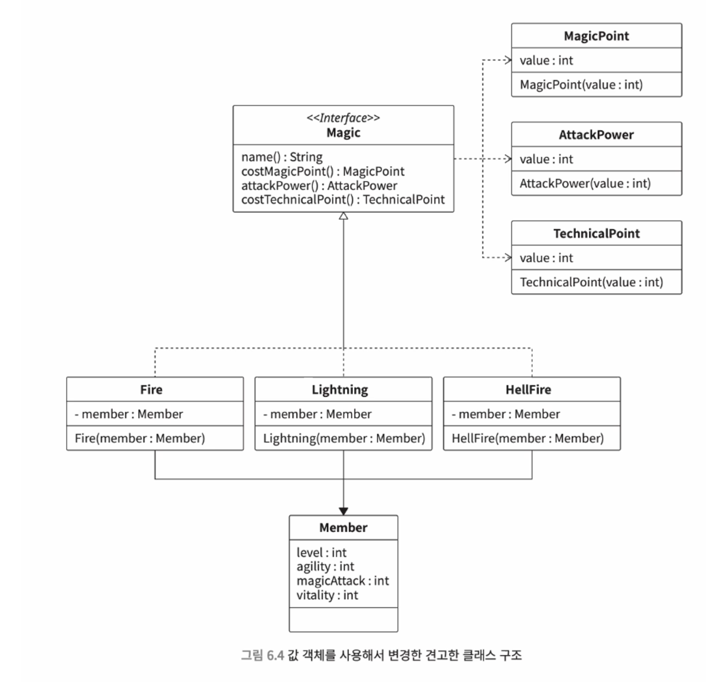

# 6. 조건 분기 : 미궁처럼 복잡한 분기 처리를 무너뜨리는 방법

## 6.1 조건 분기가 중첩되어 낮아지는 가독성

### Before: 거대한 중첩

```java
if (조건) {
	// 코드들
	if (조건) {
		// 코드들 
		if (조건) {
			// 코드들
			if (조건) {
				// 코드들
			}
		}
		// 코드들
	}
	// 코드들
}
```

- 중첩이 반복되면서 **가독성이 크게 떨어진다**.
    - 중첩 코드 사이사이에 수많은 코드가 섞여 있으면 if 조건문 범위를 파악하기 힘들다.
- 이렇게 로직을 이해하기 힘들어지면 **사양을 변경하기도 힘들고, 버그가 생기기도 쉽다**.

### After: 조기 리턴으로 중첩 제거하기

> 💡 **조기 리턴 (early return)** : 조건을 만족하지 않을 경우 바로 리턴하는 방법

```java
if (member.hitPoint <= 0) return;
if (!member.canAct()) return;
if (member.magicPoint < magic.costMagicPoint) return;

member.consumeMagicPoint(magic.costMagicPoint);
member.chant(magic);
```

- 중첩이 제거되어 **가독성이 좋아진다**.
- **조건 로직과 실행 로직을 분리**했다.
    - 필요하다면 간단하게 로직을 추가할 수 있다.
    - 실행 로직의 요구사항이 변경된 경우에도 실행 흐름을 간단하게 제어할 수 있다.

### After: 가독성을 낮추는 else 구문도 조기 리턴으로 해결하기

```java
float hitPointRate = member.hitPoint / member.maxHitPoint;

if (hitPointRate == 0) return HealthCondition.dead;
if (hitPointRate < 0.3) return HealthCondition.danger;
if (hitPointRate < 0.5) return HealthCondition.caution;

return HealthCondition.fine;
```

- 중첩된 if 조건문 내부에 있는 else 구문은 가독성을 나쁘게 만든다.
- 조기 리턴을 이용하면 else 절 자체를 사용할 필요가 없다.

---

## 6.2 switch 조건문 중복

### Before: switch 조건문을 이용해 코드 작성하기

```java
public enum MagicType {
  fire,
  lighting
}

public class MagicManager {
  String getName(MagicType magicType) {
    String name = "";
    switch (magicType) {
      case fire:
        name = "파이어";
        break;
      case lighting:
        name = "라이트닝";
        break;
    }
    return name;
  }
  
  int costMagicPoint(MagicType magicType, Member member) {
    int magicPoint = 0;
    switch (magicType) {
      case fire:
        magicPoint = 2;
        break;
      case lighting:
        magicPoint = 5 + (int)(member.level * 0.2);
        break;
    }
    return magicPoint;
  }
}
```

- MagicType enum에 따른 처리를 switch 조건문으로 구현하는 코드가 여러개 생긴다.
- 이 경우 아래와 같은 문제가 발생한다.
    - 요구사항 변경시 수정 누락 가능 → MagicType에 새로운 값이 추가되었을 때, case 누락 등
    - 요구사항 변경시 거대한 조건문 내에서 관련된 코드를 찾아야 함
    - switch 조건문으로 처리해야 할 대상이 늘어날 수록 switch-case 구문 중복 및 수정 누락 심화

### After: 조건 분기 모으기

> ❄️ **단일 책임 선택의 원칙**을 고려하여, 조건식이 같은 조건 분기를 한 번에 작성하자.

```java
public class Magic {
  final String name;
  final int costMagicPoint;
  final int attackPower;
  final int costTechnicalPoint;
  
  Magic(final MagicType magicType, final Member member) {
    switch (magicType) {
      case fire:
        name = "파이어";
        costMagicPoint = 2;
        attackPower = 20 + (int)(member.level * 0.5);
        costTechnicalPoint = 0;
        break;
      case lighting:
        name = "라이트닝";
        costMagicPoint = 5 + (int)(member.level * 0.2);
        attackPower = 50 + (int)(member.agility * 1.5);
        costTechnicalPoint = 5;
        break;
      default:
        throw new IllegalArgumentException();
    }
  }
  
}
```

- MagicType으로 조건을 분기하는 switch 조건문을 모두 하나로 묶는다.
- switch 조건문이 한 곳에 구현되어 있으므로, 사양을 변경할 때 누락 실수를 줄일 수 있다.

### After: 인터페이스로 switch 조건문 중복 해소하기

- 변경 요구사항이 많아질 수록, 위에 구현한 swtich 조건문이 길어지고 유지보수와 변경이 어려워진다.
- 클래스가 거대해짐에 따라, **인터페이스를 이용해 관심사에 따라 작은 클래스로 분할**한다.
    - 인터페이스에 공통 메서드를 정의하고, 하위 클래스가 인터페이스를 구현하게 하는 방식.
    - 조건 분기 없이도 각각의 코드를 적절하게 실행할 수 있다.

```java
public interface Magic {

  String name();
  int costMagicPoint();
  int attackPower();
  int costTechnicalPoint();

}
```

```java
public class Fire implements Magic {

  private final Member member;

  Fire(final Member member) {
    this.member = member;
  }

  public String name() {
    return "파이어";
  }

  public int costMagicPoint() {
    return 2;
  }

  public int attackPower() {
    return 20 + (int)(member.level * 0.5);
  }

  public int costTechnicalPoint() {
    return 0;
  }

}
```

- enum으로 관리되던 마법들을 마법 클래스로 전부 분리한 후, 인터페이스를 구현하게 한다.
    - 만약 메서드를 구현하지 않으면, 인터페이스의 메서드가 구현되지 않았기에 컴파일 에러가 뜬다.
    - 즉, 수정 누락 자체가 발생하지 않는다!

```java
final Map<MagicType, Magic> magics = new HashMap<>();
// 생략
final Fire fire = new Fire(member);
final Lightning lightning = new Lightning(member);

magics.put(MagicType.fire, fire);
magics.put(MagicType.lightning, lightning);

// 생략
MagicType magicType = MagicType.fire;
final Magic usingMagic = magics.get(magicType);
usingMagic.attachPower();
```

- switch 문 대신 Map 자료형에 저장한다.
- 이와 같이 **인터페이스를 이용해 처리를 한꺼번에 전환하는 설계를 전략 패턴**이라고 한다.

```java
public interface Magic {

  String name();
  MagicPoint costMagicPoint();
  AttackPower attackPower();
  TechnicalPoint costTechnicalPoint();

}
```

- 인터페이스에 값 객체를 적용하여 휴먼 에러를 줄이고 더욱 응집도 높게 만들 수 있다.



---

## 6.3 조건 분기 중복과 중첩

- 인터페이스를 사용하면 다중 중첩으로 된 복잡한 분기를 제거할 수 있다.

### before

```java
  // 골드 회원 판정
	boolean isGoldCustomer(PurchaseHistory history) {
    if (100000 <= history.totalAmount) {
      if (10 <= history.purchaseFrequencyPerMonth) {
        if (history.returnRate <= 0.001) {
          return true;
        }
      }
    }
    return false;
  }

  // 실버 회원 판정
  boolean isSilverCustomer(PurchaseHistory history) {
    if (10 <= history.purchaseFrequencyPerMonth) {
      if (history.returnRate <= 0.001) {
        return true;
      }
    }
    return false;
  }
```

- 골드 회원과 실버 회원 각각에 동일한 판정 조건이 들어갔다.

### after : 정책 패턴으로 조건 집약하기

> ❄️ **`정책 패턴`** : 조건을 부품처럼 만들고, 부품으로 만든 조건을 조합해서 사용하는 패턴

```java
interface ExcellentCustomerRule {
	boolean ok(final PurchaseHistory history);
}
```

- 하나하나의 규칙(판정 조건)을 나타내는 인터페이스 생성

```java
class GoldCustomerPurchaseAmountRule implements ExcellentCustomerRule {
	public boolean ok(final PurchaseHistory history) {
		return 1000000 <= history.totalAmount;
	}
}

class PurchaseFrequencyRule implements ExcellentCustomerRule {
	public boolean ok(final PurchaseHistory history) {
		return 10 <= history.purchaseFrequencyPerMonth;
	}
}

class ReturnRateRule implements ExcellentCustomerRule {
	public boolean ok(final PurchaseHistory history) {
		return history.returnRate <= 0.001;
	}
}
```

- 골드 회원이 되기 위해 만족해야 하는 조건을 각각의 클래스로 분리

```java
class ExcellentCustomerPolicy {
	private final Set<ExcellentCustomerRule> rules;

	ExcellentCustomerPolicy() {
		rules = new HashSet();
	}
	
	void add(final ExcellentCustomerRule rule) {
		rules.add(rule);
	}

	boolean complyWithAll(final PurchaseHistory history) {
		for (ExcellentCustomerRule each : rules) {
			if (!each.ok(history)) return false;
		}
		return true;
	}
}
```

- 정책 클래스를 만들고, complyWithAll 메서드 내부에 규칙을 모두 만족하는지 판정하는 로직을 넣는다.

```java
class GoldCustomerPolicy {
	private final ExcellentCustomerPolicy policy;

	GoldCustomerPolicy() {
		policy = new ExcellentCustomerPolicy();
		policy.add(new GoldCustomerPurchaseAmountRule());
		// 생략
	}
	
	boolean complyWithAll(final PurchaseHistory history) {
		return policy.complyWithAll(history);
	}
}
```

- 골드 회원 정책을 클래스로 만든다.
- 규칙이 재사용되고 있으므로, 이후 조건이 달라져도 수정이 간편하다.

---

## 6.4 자료형 확인에 조건 분기 사용하지 않기

### Before

```java
Money busySeasonFee;
if (hotelRates instanceof RegularRates) {
	busySeasonFee = hotelRates.fee().add(new Money(30000));
}
```

- 인터페이스 구현 클래스의 자료형을 판정하여, 그 결과를 기준으로 조건을 분기하는 경우
  - 이 경우 **조건 분기 코드가 계속 중복**된다.
  - 또한 **리스코프 치환 원칙을 위반**한다.
    - 기반 자료형(인터페이스)을 하위 자료형(인터페이스 구현 클래스)으로 변경했을 때 코드가 동작하지 않는다.

### After

```java
interface HotelRate {
	Money fee();
	Money busySeasonFee();
}

class RegularRates implements HotelRate {
	public Money fee() {
		return new Money(70000);
	}

	public Money busySeasonFee() {
		return fee().add(new Money(30000));
	}
}
```

- 인터페이스에 요금을 리턴하는 메서드를 만들고, 인터페이스 구현 클래스에서 해당 메서드를 각각 구현한다.
- 이제 호출할 때 instanceof로 자료형을 판정하지 않아도 된다.

---

## 6.5 인터페이스 사용 능력이 중급으로 올라가는 첫걸음

> ❄️ 조건 분기를 써야 하는 상황에는 일단 무조건 인터페이스 설계를 떠올리자!

|  | 초보 | 중급 이상 |
| --- | --- | --- |
| 분기 | if, switch만 사용 | 인터페이스 설계 이용 |
| 분기마다의 처리 | 로직 그냥 작성 | 클래스 사용 |

---

## 6.6 플래그 매개변수

> ❄️ **`플래그 매개변수`** : 메서드 기능을 전환하는 boolean 자료형의 매개변수

### Before

```java
void damage(boolean damageFlag, int damageAmount) {
    if (damageFlag) {
      // 생략
    }
    else {
      // 생략
    }
  }
```

- 플래그 매개변수 메서드는 내부에서 어떤 일을 하는지 예측하기 힘들다.
  - 예측하려면 무조건 메서드 내부 로직을 확인해야 함 → 가독성, 생산성 저하
  - 꼭 boolean이 아니어도 동일 (ex. int 자료형을 이용해 기능을 전환하는 경우)

### After : 메서드 분리하기

```java
void hitPointDamage(final int damageAmount) {
    // 생략
}

void magicPointDamage(final int damageAmount) {
    // 생략
}
```

- 메서드는 하나의 기능만 수행하는게 좋다!
- 기능별로 분리하고, 각각의 메서드에 맞는 이름을 붙여 가독성을 높이자.

### After : 전환은 전략 패턴으로 구현하기

- 메서드를 기능별로 분할했는데, 요구사항이 달라져 전환이 발생한 케이스
- 인터페이스를 이용해 전환하고자 하는 로직을 각 클래스에 구현하자.

```java
interface Damage {
	void execute(final int damageAmount);
}
```

```java
class HitPointDamage implements Damage {
	public void execute(final int damageAmount) {
		// 생략
	}
}

class MagicPointDamage implements Damage {
	public void execute(final int damageAmount) {
		// 생략
	}
}
```

```java
enum DamageType {
	hitPoint, magicPoint
}

private final Map<DamageType, Damage> damages;

void applyDamage(final DamageType damageType, final int damageAmount) {
	final Damage damage = damages.get(damageType);
	damage.execute(damageAmount);
}
```

- 전략 패턴을 사용하면서, 새로운 종류의 데미지가 추가되어도 대응이 쉬워진다.