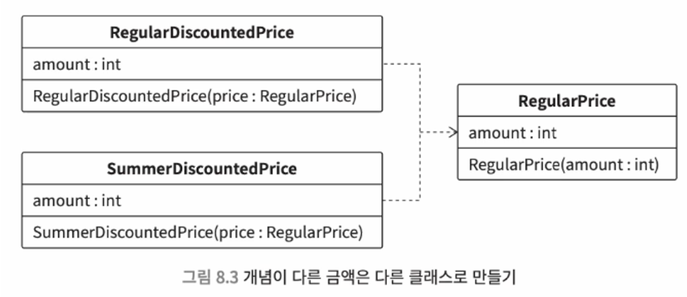
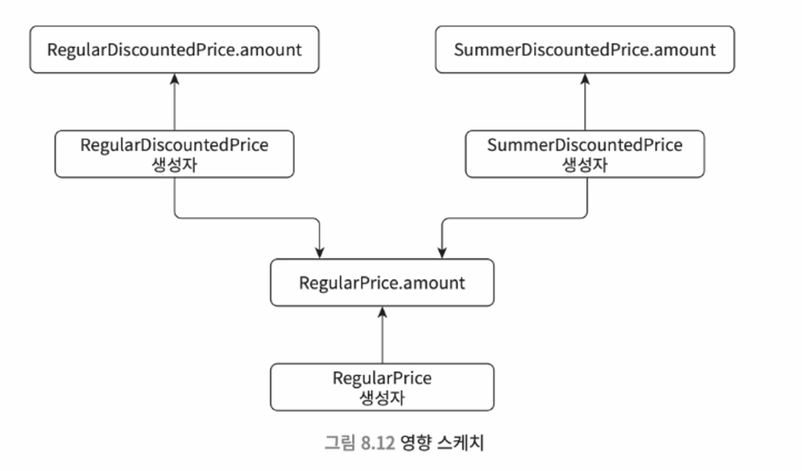

# 8. 강한 결합 : 복잡하게 얽혀서 풀 수 없는 구조

> ❄️ **결합도** <br>
> : 모듈 사이의 의존도를 나타내는 지표 <br>
> : 클래스가 다른 클래스에 많이 의존하는 강한 결합 코드는 이해하기도 어렵고, 변경하기도 힘들다.


## 8.1 결합도와 책무

> ❄️ **책무** : 의무를 다 해야 하는 책임 = 어떤 관심사를 정상적으로 작동하게 제어해야 하는 책임


- 책무를 고려하지 않은 설계란?
    - **로직의 위치에 일관성이 없는 경우**
      : 어떤 클래스에는 처리해야 할 작업이 집중되었는데, 어떤 클래스는 특별히 하는 일이 없다
      : 어떤 클래스는 편의를 위해 다른 클래스의 메서드를 무리하게 활용한다 등
      - 이런 경우, 코드를 파악하기도 힘들고 사양 변경이 발생했을 때 버그도 다양해진다.

### 단일 책임 원칙

- ‘**클래스가 담당하는 책임은 하나로 제한해야 한다**’는 원칙!
    - **‘누가 책임을 져야 하는가?’** 를 고민해보자
    - 소프트웨어의 책임 = 자신의 관심사와 관련하여, 정상적으로 동작하도록 제어하는 것
- 단일 책임 원칙을 위반한다면?
    - 책임을 대신 지는 클래스가 생기면서, 하나의 클래스가 자신의 관심사 수행을 위한 로직을 직접 처리할 수 없게 된다. 이 과정에서 코드 중복이 발생한다.

### 느슨한 결합

- 관심사에 따라 분리해서 독립되어 있는 구조
- 특정 관심사와 관련된 사양이 변경되어도, 서로 영향을 주지 않는다.

  

### DRY 원칙의 잘못된 적용

> ❄️ **`DRY 원칙`** <br>
> : 모든 지식은 시스템 내에서 단 한번만, 애매하지 않고, 권위 있게 표현되어야 한다.


- 즉 DRY 원칙은 무조건 반복하지 말라는게 아니라, 각각의 개념 단위 내에서 반복을 하지 말라는 의미다.
- **같은 로직, 비슷한 로직이라도 개념이 다르면 중복을 허용해야 한다.**
    - 개념적으로 다른 것까지도 무리하게 중복을 제거하려고 하면 강결합이 발생해 단일 책임 원칙이 깨진다.

---

## 8.2 다양한 강한 결합 사례와 대처 방법

### 상속과 관련된 강한 결합

- 상속은 주의해서 다루지 않으면 강한 결합을 유발한다. 이 책에선 상속 자체를 권장하지 않는다.
- 상속은 **서브 클래스가 슈퍼 클래스에 강하게 의존하는 구조**를 만든다.
    - 상속을 쓰면, 서브 클래스는 슈퍼 클래스 로직을 그대로 사용하게 된다. 즉 슈퍼 클래스는 공통 로직을 두는 장소가 된다.
        - 슈퍼 클래스는 서브 클래스를 신경쓰지 않고 변경하지만, 서브 클래스는 슈퍼 클래스 구조 하나하나에 영향을 받는다. 슈퍼 클래스 변화를 놓치는 순간 버그가 발생할 수 있다.
    - 또한, 슈퍼 클래스 메서드를 서브 클래스에서 오버라이드 하면, 하나의 로직으로 봐야 하는 흐름이 두 클래스에 분산된 구조가 된다. (인터페이스는 슈퍼, 로직은 서브)
        - 어디서부터 어디까지가 관련있는지 로직을 추적하기 어려워져, 디버깅과 요구 변경 반영이 힘들다.
- 상속 대신 컴포지션 (합성)을 사용하자.
    - 컴포지션 = **사용하고 싶은 클래스를 private 인스턴스 변수로 갖고 사용**하는 것

### 템플릿 메서드 패턴

- 상속받는 쪽에서 차이가 있는 로직만을 구현하는 템플릿 메서드 패턴을 활용해, 상속을 문제 없이 사용할 수 있다.
- 하지만 상속은 강결합과 로직 분산을 야기하므로 신중하게 사용해야 한다.
    - 값 객체, 컴포지션 등 다른 설계를 사용할 수 없는지 검토하고 사용하자.

### 인스턴스 변수별로 클래스 분할이 가능한 로직

- 책임이 다른 메서드가 한 클래스에 안에 적의되어 있으면 강결합 문제가 발생한다.

    ```java
    class Util {
    	private int reservationId;
    	private ViewSettings viewSettings;
    	private MailMagazine mailMagazine;
    
    	void cancelReservation() {
    		// reservationId를 이용한 예약 취소 처리
    	}
    
    	void darkMode() {
    		// viewSettings를 이용한 다크 모드 표시 전환 처리
    	}
    
    	void beginSendMail() {
    		// mailMagazine를 이용한 메일 전송 처리
    	}
    }
    ```

- 각 메서드가 어떤 인스턴스 변수를 사용하는지 보고, 인스턴스 변수 별로 클래스를 분할하자.

    ```java
    class Reservation {
    	private final int reservationId;
    
    	void darkMode() {
    		// reservationId를 이용한 예약 취소 처리
    	}
    }
    
    class ViewCustomizing {
    	private ViewSettings viewSettings;
    
    	void cancel() {
    		// viewSettings를 이용한 다크 모드 표시 전환 처리
    	}
    }
    ```

- 각 인스턴스 변수와 메서드 무엇이 관련 있는지 파악할 때는 **영향 스케치**를 그려보자.

  
    - Jig 같은 도구를 써서 소스 코드를 분석하여 영향 스케치를 자동으로 그릴 수도 있다.

### 특별한 이유 없이 public 쓰지 말기

- 이유 없이 public을 쓰면, 외부 패키지에서 접근할 수 있기에 강한 결합 구조를 만든다.
- ex. 내부에서 제어할 목적으로만 사용하는 클래스의 경우, 화면에 표시하거나 외부에서 제어할 필요가 없다.
    - 이때 public을 사용하면 관계를 맺지 않았으면 하는 클래스끼리도 결합될 수 있고, 영향 범위도 넓어진다.
- 강결합을 피하기 위해 접근 수식자를 이용해 가시성을 적절하게 제어하자.

> ❄️ **접근 수식자를 생략한 디폴트 상태가 package private인 이유?** <br>
> : 패키지들의 불필요한 의존 관계를 피할 때 적절하기 때문. <br>
> : 패키지는 밀접한 클래스끼리는 응집하게, 그러나 패키지 외부 클래스와는 느슨하게 결합해야 한다.


### private 메서드가 많다 = 책임이 많다

- 여러 책임 로직이 private 메서드로 구현되어 클래스에 너무 많은 책임이 몰리는 경우가 많다.
- private 메서드가 많다면 책임이 다른 메서드는 다른 클래스로 분리하여 클래스를 가볍게 만들자.

### 높은 응집도를 오해해서 생기는 강한 결합

- **응집도가 높은 구조 = 관련이 깊은 데이터와 논리를 한 곳에 모은 구조**
- 이를 오해해서 관련이 깊은 데이터가 아니라, 서로 다른 개념의 데이터를 한 곳에 모아 강결합을 만들기 쉽다.
- **결합이 느슨하고 응집도가 높은 설계**를 만들 수 있도록 값 객체를 잘 활용하자!

> ❄️ 응집도를 높이는 설계를 할 때는 **다른 개념이 섞여 들어와 강한 결합을 만드는게 아닌지 항상 주의**하자.


### 스마트 UI

> ❄️ **스마트 UI** <br>
> : 화면 표시를 담당하는 클래스 중에서 화면 표시와 직접적인 관련이 없는 책무가 구현되어 있는 클래스


- 빠른 개발을 위해 복잡한 계산 로직 등을 프론트에 구현하는 경우가 많다.
- 이 경우, 이후 화면 디자인을 수정하려면 기능은 그대로 두면서 디자인만 바꿔야 하기에 꽤 복잡해진다.
- 즉, 스마트 UI는 화면 표시에 관한 책무와 그렇지 않은 책무가 강하게 결합되어 변경하기 힘들어지는 상황을 야기한다.
    - 이를 해결하기 위해, 디자인 관련과 로직 관련은 서로 다른 클래스로 분할하는게 좋다.

### 거대 데이터 클래스

- 수많은 인스턴스 변수를 갖는 거대한 데이터 클래스는 설계를 고려하지 않았기에 강결합을 야기한다.
- 거대한 데이터 클래스는 많은 데이터가 모여, 많은 유스케이스에서 사용되기에 전역 변수와 같은 성질을 띈다.
    - 즉, 동기화하느라 성능이 저하되는 등의 다양한 폐해가 발생한다.
- 따라서 **유스케이스를 파악하고, 각각에서 필요한 데이터만 접근하고 사용할 수 있게 클래스를 쪼개자**.

### 트랜잭션 스크립트 패턴

> ❄️ **트랜잭션 스크립트 패턴** <br>
> : 메서드 내부에 일련의 처리가 하나하나 길게 작성된 구조


- 데이터를 보유하고 있는 클래스(데이터 클래스)와 데이터를 처리하는 클래스를 나누어 구현할 때 발생한다.
- 남용하면 메서드 하나가 아주 길어질 수 있기에, 응집도는 낮고 결합은 강한 구조를 야기한다.

### 갓 클래스 (god class)

> ❄️ **갓 클래스** <br>
> : 하나의 클래스 내부에 수천에서 수만 줄의 로직을 담고 있으며, 수많은 책임을 담당하는 로직이 난잡하게 섞여 있는 클래스


- 어떤 로직과 관련 있는지 책무를 파악하기 힘들다.
- 기능 수정을 위해, 영향 범위를 파악할 때 수천 수만 줄의 로직을 읽어야 한다.
    - 이때 놓치는 부분이 생기기 쉬우니 버그가 생기기도 쉽다.
- 잘못된 값을 검출하는 로직도 난잡하며, 심지어 작성되지 않았을 수도 있다.
    - 따라서 문제가 생겼을 때 원인 추적이 힘들다.

### 강한 결합 클래스 대처 방법

- 거대한 강한 결합 클래스는 책임별로 클래스를 분할해야 한다.
    - 단일 책임 원칙에 따라 설계된 클래스는 아무리 많아도 200줄, 보통은 100줄 정도 된다.
- 조기 리턴, 전략 패턴, 일급 컬렉션, 목적 중심 이름 설계 등의 방법을 시도해볼 수 있다.