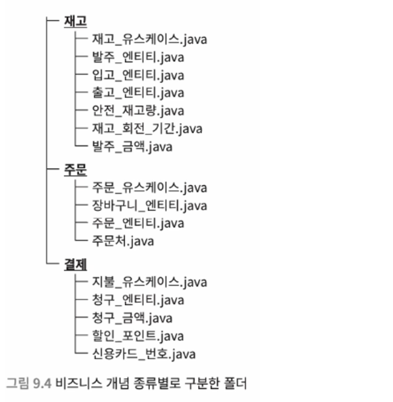

# 9. 설계의 건전성을 해치는 여러 악마

## 9.1 데드 코드

> ❄️ 데드 코드 (= 도달 불가능한 코드) : 절대로 실행되지 않는 조건 내부에 있는 코드

```java
if (level > 99) level = 99;

if (level == 1) ... 
else if (level == 100) addSpecialAbility();
```

- addSpecialAbility()는 절대로 실행되지 않는 데드 코드이다.
- 데드 코드는 아래와 같은 문제를 야기한다.
    - 코드 가독성 저하
        - 이 코드가 언제 실행되는 코드인지 고민하게 만든다
        - 실제로 실행되지 않는 코드인데 왜 남겨둔건지, 어떤 의도가 있는 것인지 등..
    - 버그 발생
        - 실행되지 않던 데드 코드가 사양 변경에 의해 도달 가능한 코드가 되어 의도치 않게 동작
- **데드 코드는 발견하는 즉시 제거하도록 하자!**

---

## 9.2 YAGNI 원칙

> ❄️ YAGNI : You Aren’t Gonna Need It - 지금 필요 없는 기능을 만들지 마라!

- 왜 YAGNI 원칙을 지켜야 할까?
    - 소프트웨어 요구 사항은 매일 바뀐다. 미리 예측하고 구현해봤자, 어차피 대부분 들어맞지 않는다.
        - 이렇게 들어맞지 않는 코드는 곧 데드 코드가 되거나, 복잡하게 꼬이며 가독성을 저하시킨다.
        - 즉 시간 낭비이며, **지금 필요한 기능을 최대한 간단히 만들어 가독성과 유지 보수성을 높이는게** 중요!

---

## 9.3 매직 넘버

> ❄️ 매직 넘버 : 로직 내부에 직접 작성되어 구현자 본인 이외엔 의미를 알기 힘든 숫자

```java
void tryConsume() {
	int tmp = value - 60;
	if (tmp < 0) {
		throw new RuntimeException();
	}
	value = tmp;
}
```

- 여기서 60은 뭘 의미하는걸까? 의미를 알기 힘들다.
- 매직 넘버는 가독성을 떨어뜨리며, 동일한 값이 여러 위치에 등장하는 경우 코드 중복을 야기한다.

```java
private static final int MIN = 0;
private static final int TRIAL_READING_POINT = 60;

void tryConsume() {
	int tmp = value - 60;
	if (tmp < 0) {
		throw new RuntimeException();
	}
	value = tmp;
}
```

- **매직 넘버를 상수로 만들어 활용**하도록 하자!
- 값의 의미를 빠르고 쉽게 이해할 수 있고, 이후 사양 변경에 의해 값을 바꿔야 할 때도 한 줄만 수정하면 된다.

---

## 9.4 문자열 자료형에 대한 집착

```java
String title = "타이틀,255,250,240,64";
```

- String 변수 하나에 여러 값을 저장 한 후, split 메서드 등으로 문자열을 분할하여 원하는 값을 꺼내는 케이스
- 의미를 알기 힘들고, split 메서드 떄문에 쓸데없이 로직이 복잡해져 가독성이 저하된다.
- 자료형이 같다고 하나의 변수로 퉁치지 말고, **의미가 다른 값은 각각 다른 변수에 저장**하자.

---

## 9.5 전역 변수

```java
public OrderManager {
	public static int currentOrderId;
}
```

- 모든 곳에서 접근할 수 있는 전역 변수는 다음과 같은 문제를 야기한다.
    - 언제 어디에서 값을 변경했는지 파악하기 어려움
    - 전역 변수를 참조하는 로직을 변경할 때, 또 다른 참조 로직에서 버그가 발생하지는 않는지 검토해야 한다.
    - 동기화 할 때 락을 얻기 위한 대기시간이 길어져 성능 저하가 생길 수 있고, 자칫 데드락에 빠질 수도 있다.
- **전역 변수, public static으로 선언된 변수, 거대 데이터 클래스 등 전역 변수와 같은 개념은 경계**하자.
    1. 전역 변수(또는 거대 데이터 클래스)의 영향 범위를 가능한 좁게 줄이자.
        1. 관계 없는 로직에선 접근할 수 없게 해야 한다.
        2. 호출할 수 있는 위치가 적고 국소적일 수록 로직을 이해하고 구현하기 쉽다.
    2. 전역 변수가 꼭 필요한지 검토해보자.
        1. 전역 변수를 참조하려는 곳이 그렇게 많을까?
        2. 최대한 한정적인 클래스에서만 접근할 수 있게 설계하자.

---

## 9.6 null 문제

```java
class Member {

	void takeOffAllEquipments() {
		head = null;
		body = null;
		arm = null;
	}

}
```

- 위와 같이 인스턴스 변수에 null이 할당되면, 다른 코드에서 NPE가 발생할 수 있다.
- 이를 방지하기 위해 매소드마다 null 체크를 하면 코드가 길고 복잡하며 불안정해진다.
- null 은 아예 상태조차 존재하지 않는다는 의미이므로, **단순히 미설정 상태 & 입력 전의 상태를 표현할 때 사용하긴 부적절**하다.

```java
class Member {

	static final Equipment EMPTY = new Equipment("장비 없음", 0, 0, 0);

}
```

- 애초에 null을 다루지 않게 만들어 다음을 만족하게 만들자.
    - null을 리턴하지 않는 설계 : 메서드가 null을 리턴하지 않는다.
    - null을 전달하지 않는 설계 : 메서드에서 null을 변수에 할당하지 않는다.
        - **미설정 상태 & 값 할당 이전의 상태를 static final 인스턴스 변수로 따로 분리**하자.
- 코틀린은 null 안전 자료형을 제공하여, null이 할당되면 컴파일 에러를 발생시킨다.

    ```kotlin
    val name: String = null // 컴파일 오류
    ```


---

## 9.7 예외를 catch 하고서 무시하는 코드

```java
try {
	reservations.add(product);
} catch (Exception e) {
}
```

- 예외를 catch 했으나 아무런 처리를 하지 않는다. 이는 다음과 같은 문제를 야기한다.
    - 오류가 발생해도 탐지할 방법이 없어, 원인 분석을 어렵게 만든다.
        - 이 경우, 오류가 발생해도 외부에서 아무 문제가 없어 보이기에, 잘못된 데이터를 이용하다가 또 다른 잘못된 데이터를 만들게 될 수 있다.
    - 개발자가 아닌 서비스 사용자가 예외 상황을 보고하게 만든다.
        - 개발자들은 어느 시점에 어떤 코드에서 문제가 발생했는지 찾기 위해, DB 레코드, 로그, 관련 코드를 직접 하나하나 뒤져야 한다.

```java
try {
	reservations.add(product);
} catch (Exception e) {
	// 오류 보고 및 로그에 기록
	reportError(e);
	// 상위 레이어에 오류와 관련된 통지 요구
	requestNotifyError("예약할 수 없습니다");
}
```

- 따라서 모든 경우에 **예외 처리를 추가하고, 예외를 확인하면 곧바로 통지 및 기록, 상황에 따라 복구**해야 한다.
    - 문제가 발생하는 즉시 소리쳐서 잘못된 상태를 막도록 하자.

---

## 9.8 설계 질서를 파괴하는 메타 프로그래밍

> ❄️ 메타 프로그래밍 : 프로그램 실행 중 해당 프로그램 구조 자체를 제어하는 프로그래밍

### 리플렉션 (java)

- 자바에서 메타 프로그래밍을 활용해 클래스 구조를 읽고 쓸 때는 리플렉션 API를 활용한다.
- 단, 메타 프로그래밍은 용법과 의도를 제대로 이해하지 못하고 사용하면 전체 설계를 무너뜨릴 수 있다.

```java
public class Level {

  private static final int MIN = 1;
  private static final int MAX = 99;
  final int value;

  private Level(final int value) {
    if (value < MIN || MAX < value) {
      throw new IllegalArgumentException();
    }
    this.value = value;
  }

  static Level initialize() {
    return new Level(MIN);
  }

  Level increase() {
    if (value < MAX) return new Level(value + 1);
    return this;
  }

}
```

- final, 상수 MIN/MAX와 가드를 활용했기에 잘못된 값이 끼어들 수 없는 구조.

```java
Level level = Level.initialize();
System.out.println("Level : " + level.value);  // 1
    
Field field = Level.class.getDeclaredField("value");
field.setAccessible(true);
field.setInt(level, 999);

System.out.println("Level : " + level.value);  // 999
```

- 불변 변수인 value의 값이 바뀌며, 심지어 MIN/MAX의 범위를 벗어난다.
- 리플렉션을 활용하면 위와 같이 불변 변수의 값을 바꾸고, private 변수에 외부에서 접근할 수 있고, 상수의 값을 바꾸는 등 이상 동작을 유발할 수 있다.
    - 따라서 **리플렉션을 남용하면, 잘못된 상태로부터 클래스를 보호하는 설계, 영향 범위를 최대한 좁게 만드는 설계 모두가 영향을 받게 된다**.

### 자료형의 장점을 살리지 못하는 하드 코딩

```java
static Object generateInstance(String packageName, String className) throws Exception {
    String fileName = packageName + "." + className;
    Class klass = Class.forName(fileName);
    Constructor constructor = klass.getDeclaredConstructor();
    return constructor.newInstance();
  }

// ...

User user = (User)generateInstance("customer", "User");
```

- 리플렉션의 generateInstance 메서드를 이용해 클래스 인스턴스를 생성할 수 있다.
- 이 경우, **IDE의 정적 분석 기능을 사용할 수 없다**.
    - ex. User 클래스 이름을 Employer로 변경한 경우, user은 이름이 변경되지 않는다.

    ```java
    Employer user = (Employer)generateInstance("customer", "User"); // 컴파일 에러
    ```

    - “User”가 단순 String이기 때문에, User 자료형으로 인식되지 않기 때문이다.

### 단점을 이해하고 용도를 한정하여 사용하기

- 메타 프로그래밍의 단점을 이해해야 유지 보수와 변경에 쉬운 설계를 유지할 수 있다.
- 사용하고 싶다면 시스템 분석 용으로 한정하거나, 아주 작은 범위에서만 활용하는 식으로 리스크를 최소화 해야 한다.

---

## 9.9 기술 중심 패키징

> ❄️ 기술 중심 패키징 : 구조에 따라 폴더와 패키지를 나누는 것

- 레일스, 장고, 스프링 등은 프레임워크의 표준적인 구조가 기술 중심 패키징이라서 (MVC 모델), 폴더 구조를 기술 중심 패키징에 맞게 구성하기 쉽다.
- 비즈니스 개념을 나타내는 클래스 (엔티티 등)를 기술 중심 패키징에 따라 구분하면 관련성을 알기 어려워진다.
    - 따라서 비즈니스 클래스는 관련된 비즈니스 개념을 기준으로 폴더를 구분하는게 좋다.

      
        - 이 경우 재고 유스케이스에서만 사용되는 안전 재고량 클래스를 package private으로 만들 수 있고, 주문과 결제 등 **관계 없는 유스케이스에서 참조할 위험을 방지**할 수 있다.
        - 또한 관련된 개념끼리 모여있기에 **사양이 달라졌을 때 한 폴더만 읽으면 된다**.

---

## 9.10 샘플 코드 복사해서 붙여넣기

- 공식 문서에 있는 샘플 코드를 그대로 복붙하면 설계 측면에서 좋지 않은 구조가 되기 쉽다.
- 샘플 코드는 어디까지나 언어의 사양, 라이브러리의 기능을 설명하기 위해 작성된 것이지, 유지 보수성과 변경 용이성까지 생각해서 작성된 코드는 아니라는 걸 참고하자.

---

## 9.11 은 탄환

- 소프트웨어 개발에는 은탄환이 없다
- 실생활에서 발생하는 문제는 보통 특정 기술 하나로 해결할 수 없는, 매우 복잡하게 얽혀 있는 문제들이다.
    - 이런 것을 해결하기 위해 상황을 고려하지 않고 편리한 기술 하나만을 고집하면 오히려 문제를 복잡하게 꼴 수도 있다.
- 어떤 문제가 있을 때, 어떤 방법이 해당 문제에 효과적인지, 비용이 더 들지는 않는지를 평가하고 판단하는 자세가 중요하다. **문제와 목적을 머릿속에 새겨두고 적절한 기술을 선택**하자.
- Best는 없고 항상 Better를 목표로 해야 한다.